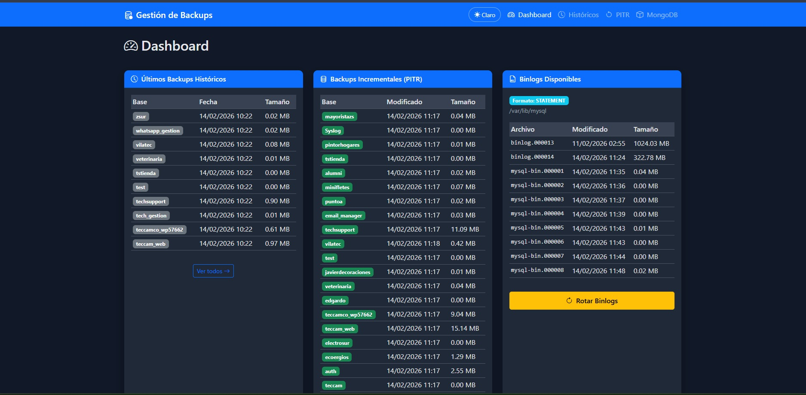
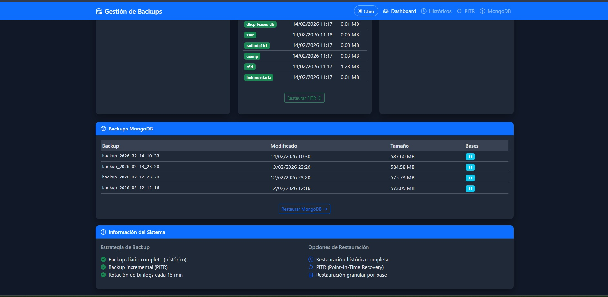
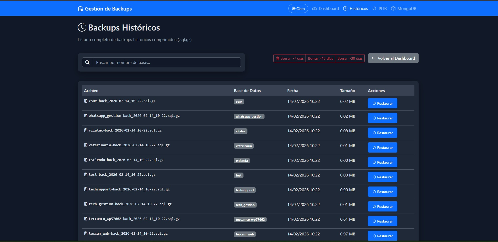
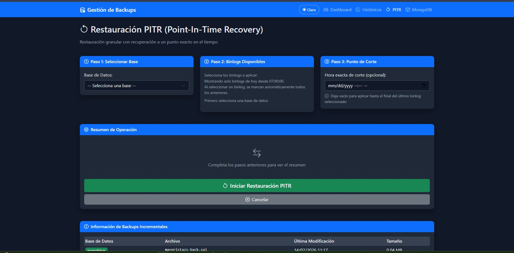
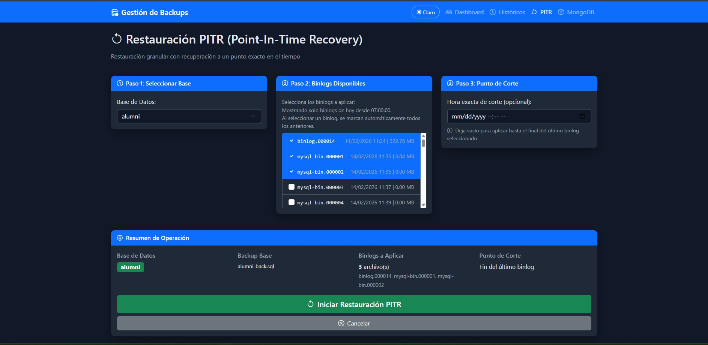
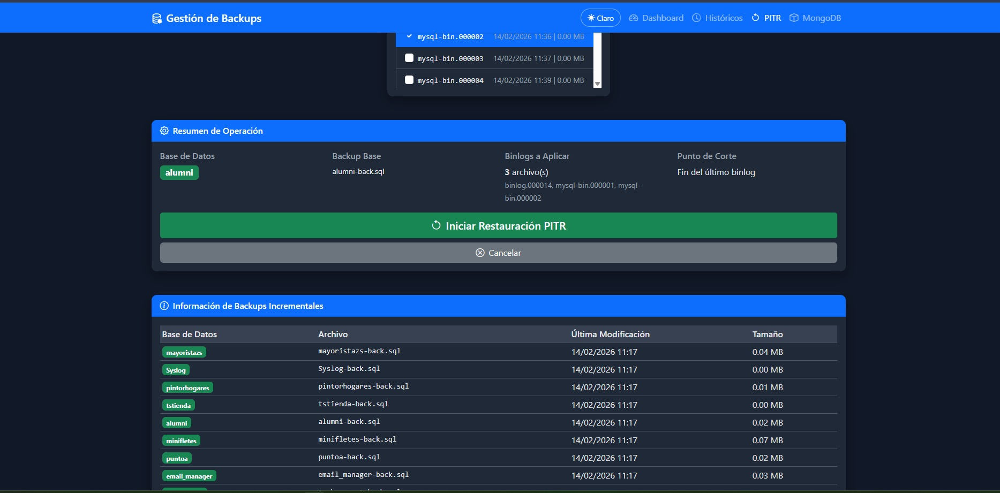

# MySQL Backup & PITR Web

Aplicación web Flask para gestionar backups y restauraciones MySQL, incluyendo restauración histórica y PITR (Point-In-Time Recovery) por base de datos.

Este documento unifica la operación diaria y las decisiones técnicas principales del proyecto.

---

## Capturas de la interfaz









---

## 1) Objetivo del proyecto

Resolver desde web lo mismo que hacen los scripts operativos:

- `restaurar_historico.sh`: restauración desde backup histórico (`.sql.gz`)
- `restaurar-single-granular.sh`: restauración PITR por base (backup base + binlogs)

Los scripts `back-*.sh` y `rotate_binlogs.sh` se usan para generación/rotación de backups (normalmente por cron).

---

## 2) Arquitectura (resumen)

- **Backend**: Flask monolítico en `app.py`
- **Frontend**: templates Jinja + Bootstrap
- **Ejecución**: desarrollo (`python app.py`) o Gunicorn/systemd
- **Datos fuente**:
  - Backups históricos en `DIR_DESTINO`
  - Backups base PITR en `DIR_DESTINO_INC`
  - Binlogs desde `BINLOG_BACKUP_DIR` (si existe y contiene binlogs) o fallback automático a `datadir` MySQL

---

## 3) Requisitos

- Python 3.8+
- MySQL/MariaDB con binlogs habilitados
- Usuario MySQL con permisos para:
  - listar bases
  - consultar variables (`datadir`, `binlog_format`)
  - restaurar por `mysql`
- Acceso de lectura del usuario de la app a los binlogs (ej. `/var/lib/mysql`)

---

## 4) Configuración `.env`

Variables mínimas:

```env
MYSQL_USER="usuario"
MYSQL_PASS="password"
MYSQL_HOST="127.0.0.1"

DIR_DESTINO="/mnt/backup/mysql"
DIR_DESTINO_INC="/mnt/backup/mysql/incremental"

# Opcional: si no se define, la app usa datadir de MySQL
BINLOG_BACKUP_DIR="/mnt/backup/mysql/binlogs"

# Hora de inicio para listar binlogs PITR del día actual
HORA_INICIO="07:00:00"

# Bases a excluir globalmente (separadas por '|')
EXCLUDE_DB="information_schema|performance_schema|mysql|sys"
```

Notas:
- Si `BINLOG_BACKUP_DIR` no está definido o está vacío/sin binlogs, la app consulta `SHOW VARIABLES LIKE 'datadir'` y usa esa ruta.
- En `/pitr`, el Paso 2 muestra solo binlogs del día actual desde `HORA_INICIO`.
- `EXCLUDE_DB` aplica globalmente en la GUI para MySQL: evita mostrar/listar/seleccionar esas bases en listados y restauraciones.
- Proteger `.env` (`chmod 600 .env`).

---

## 5) Ejecución

### Desarrollo

```bash
source venv/bin/activate
python3 app.py
```

### Producción (ejemplo Gunicorn)

```bash
gunicorn -w 4 -b 0.0.0.0:8200 app:app
```

### Producción con systemd (instalador automático)

Se incluye el script `install_systemd_service.sh` para crear/instalar el servicio
`mysql-backup-web.service` y ejecutarlo con Gunicorn.

```bash
chmod +x install_systemd_service.sh
./install_systemd_service.sh
```

Comandos útiles:

```bash
sudo systemctl status mysql-backup-web
sudo journalctl -u mysql-backup-web -f
sudo systemctl restart mysql-backup-web
```

---

## Estrategia operativa de cron (ejemplo)

Ejemplo de `crontab` **sin rutas reales**:

```cron
# Backup MySQL
0 23 * * *   /usr/bin/bash /ruta/proyecto/back-sql-no-data.sh
10 23 * * *  /usr/bin/bash /ruta/proyecto/back-sql-single.sh
0 5 * * *    /usr/bin/bash /ruta/proyecto/back-sql-single-inc.sh
*/15 7-18 * * * /usr/bin/bash /ruta/proyecto/rotate_binlogs.sh

# Backup MongoDB
20 23 * * *  /usr/bin/bash /ruta/proyecto/back-mongo.sh
```

### Qué estrategia implementa

1. **MySQL histórico diario (noche)**
   - `back-sql-no-data.sh` y `back-sql-single.sh` generan el respaldo completo histórico del día.

2. **MySQL base para PITR (madrugada)**
   - `back-sql-single-inc.sh` genera la base sobre la que luego se aplican binlogs.

3. **Rotación de binlogs en horario operativo**
   - `rotate_binlogs.sh` cada 15 minutos entre 07:00 y 18:59 para granularidad de recuperación durante el día.

4. **MongoDB histórico diario**
   - `back-mongo.sh` genera un `mongodump` histórico al cierre del día.

Con esta combinación se cubren dos necesidades:
- **Recuperación histórica** (snapshots diarios)
- **Recuperación fina MySQL tipo PITR** (base + binlogs)

---

## 6) Flujo funcional

### A) Restauración histórica

1. Seleccionar backup histórico en `/historical`
2. Confirmar escribiendo `SI`
3. Ejecuta restauración completa del archivo seleccionado

### B) Restauración PITR por base

1. Seleccionar base
2. Seleccionar binlogs (solo del día actual desde `HORA_INICIO`)
3. Definir hora de corte (opcional)
4. Confirmar escribiendo `SI`

Comodidad de selección en UI:
- Al seleccionar un binlog, se marcan automáticamente todos los binlogs anteriores de la lista (secuencia acumulada).

Implementación:
- Restaura primero `${DB}-back.sql` de `DIR_DESTINO_INC`
- Aplica binlogs con:
  - `mysqlbinlog --database="<db_seleccionada>" --start-datetime ... [--stop-datetime ...]`

> Esto está diseñado para aplicar cambios de la base seleccionada, no de forma global.

### C) MongoDB (restauración histórica total o parcial)

Nueva sección en menú: **MongoDB** (`/mongodb`)

Flujo disponible:
1. Seleccionar backup histórico de `mongodump` (carpeta `backup_*`)
2. Elegir modo:
   - **Restauración Total**: aplica todo el backup Mongo
   - **Restauración Parcial**: permite seleccionar una o más bases dentro del backup
3. Confirmar escribiendo `SI`

Detalles técnicos:
- Usa `mongorestore` con credenciales de `.env` (`HOST`, `PUERTO`, `USUARIO`, `CONTRASENA`, `AUTH_DB`).
- Modo total: `mongorestore --drop <backup_path>`
- Modo parcial: por cada base seleccionada usa `mongorestore --drop --db <db> <backup_path>/<db>`

### D) Limpieza de backups históricos por antigüedad

Disponible en UI en:
- `/historical` (MySQL)
- `/mongodb` (MongoDB)

Acciones rápidas:
- Borrar backups con más de **7 días**
- Borrar backups con más de **15 días**
- Borrar backups con más de **30 días**

Notas:
- Siempre requiere confirmación escribiendo `SI`.
- MySQL: elimina archivos `*-back_*.sql.gz` antiguos de `DIR_DESTINO`.
- MongoDB: elimina carpetas `backup_*` antiguas de `DESTINO`.

---

## 7) Configuración del motor MySQL para PITR

En `my.cnf`:

```ini
[mysqld]
log-bin = mysql-bin
binlog_format = STATEMENT
expire_logs_days = 7
```

Reiniciar MySQL:

```bash
sudo systemctl restart mysql
```

---

## 8) Importante: precisión con `STATEMENT`

`STATEMENT` habilita el filtrado por base (`--database`) necesario para PITR granular.

Pero hay un trade-off:
- Si tus sentencias usan funciones no deterministas (`NOW()`, `RAND()`, `UUID()`, etc.), al reproducir binlogs esos valores pueden no coincidir exactamente con los originales.

Recomendación para datos críticos:
- Evitar funciones no deterministas en operaciones sensibles, o
- Calcular/persistir valores explícitos antes de guardar.

---

## 9) Permisos recomendados (binlogs)

No usar `sudo` dentro de la app web.

Preferir permisos de mínimo privilegio para el usuario que corre la app (ej. `jose`):

1. agregar al grupo `mysql`, y/o
2. aplicar ACL puntual de lectura en datadir/binlogs.

Ejemplo ACL:

```bash
sudo setfacl -m u:jose:rx /var/lib/mysql
sudo setfacl -m u:jose:r /var/lib/mysql/mysql-bin.*
```

---

## 10) Estructura principal del repo

```text
mysql_backup/
├── app.py
├── back-sql-single.sh
├── back-sql-single-inc.sh
├── rotate_binlogs.sh
├── restaurar_historico.sh
├── restaurar-single-granular.sh
├── templates/
├── .env
├── .env.example
├── README.md                      <- documento unificador
├── README_WEB_INTERFACE.md        <- detalle operativo extendido
└── documento.md                   <- detalle técnico extendido
```

---

## 11) Documentación extendida

- `README_WEB_INTERFACE.md`: instalación operativa extensa, servicio, troubleshooting.
- `documento.md`: estrategia PITR detallada, cron y fundamentos técnicos.

Si hay contradicción, usar este orden de prioridad:
1. Código (`app.py` y scripts)
2. `README.md` (este documento)
3. `README_WEB_INTERFACE.md` / `documento.md`
